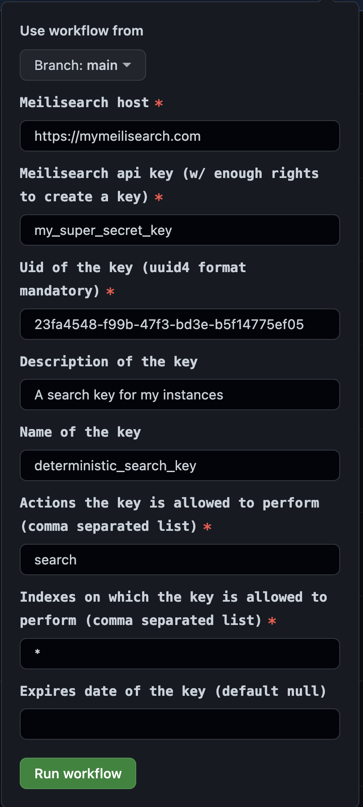

  

<h1 align="center">Determinitic key creator for a Meilisearch instance</h1>

<h4 align="center">
  <a href="https://github.com/meilisearch/meilisearch">Meilisearch</a> |
  <a href="https://docs.meilisearch.com">Documentation</a> |
  <a href="https://slack.meilisearch.com">Slack</a> |
  <a href="https://www.meilisearch.com">Website</a> |
  <a href="https://docs.meilisearch.com/faq">FAQ</a>
</h4>

  
  
  

 

A Manually triggered CI to create a deterministic api key on a given Meilisearch instance

 

Using the [manual workflow](https://github.com/bidoubiwa/deterministic_key_creation/actions/workflows/create-key.yml) create automatically a key on your Meilisearch instance with a specific key uid.

The purpose of this tool is to be able to quickly re-create a deterministic key everytime you update your Meilisearch or, when you create another instance that should have the same credentials as another.

## Usage

1. Go to the [workflow page](https://github.com/bidoubiwa/deterministic_key_creation/actions/workflows/create-key.yml)
2. Click on `Run Workflow`
3. Fill the form
4. Click on `Run workflow` at the bottom of the form

## Example

## 🤖 Compatibility with Meilisearch

This package only guarantees the compatibility with the [version v0.28.0 of Meilisearch](https://github.com/meilisearch/meilisearch/releases/tag/v0.28.0).

